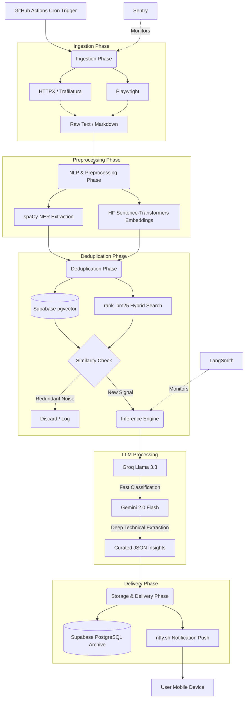

# GlaceX.ai - Product Requirements Document (PRD)

## 1. Product Vision & Overview
**GlaceX.ai** is an autonomous, multi-agent curation engine engineered to consolidate the chaotic, fast-moving AI ecosystem into a single, high-signal intelligence feed. 

It solves the problem of "AI information fatigue" by replacing the manual tracking of dozens of Substack newsletters, Discord channels, daily arXiv uploads, and product launches with an automated background pipeline. Instead of generic summaries, GlanceX.ai acts as a deeply technical filter—extracting raw architectural advancements, isolating the operational utility of developer tools, mapping startup ecosystems, and cross-referencing against an internal database to eliminate redundant media noise.

## 2. Technical Stack Architecture ($0 Budget Optimized)
This stack is built entirely on high-leverage, zero-cost developer tiers. It eliminates always-on hosting fees by using a Serverless Batch Architecture, running the entire pipeline on a scheduled automation loop.

| Layer | Component | Chosen Technology | Role in GlanceX.ai |
| :--- | :--- | :--- | :--- |
| **Orchestration** | Core Framework | **LangChain (Python)** | Powers document loaders, handles RAG chains, and manages the EnsembleRetriever framework. |
| **Inference Engine** | Dual-LLM Pipeline | **Groq API + Gemini 2.0 Flash** | **Groq (Llama 3.3):** Fast classification and duplicate checks. **Gemini Flash:** Massive 1M token context for full paper extraction and deep summaries. |
| **Data Scraping** | Clean Web Crawling | **Playwright + HTTPX + Trafilatura** | Bypasses call limits of paid APIs. Pulls clean text/markdown from raw HTML and RSS feeds for free. |
| **Database** | Relational & Storage | **Supabase (PostgreSQL)** | Central datastore for raw HTML logs, source configurations, relational metadata, and article archiving. |
| **Vector Engine** | Semantic Memory | **Supabase (pgvector)** | Runs direct vector similarity calculations right inside Postgres, eliminating external vector hosting needs. |
| **Local NLP** | Embeddings & Parsing | **HF sentence-transformers + spaCy** | **Sentence-Transformers:** Generates embeddings locally on CPU (`bge-small-en-v1.5`). **spaCy:** Ultra-fast local Named Entity Recognition (NER). |
| **Hybrid Search** | Dual Retrieval | **rank_bm25** | Works alongside pgvector via Reciprocal Rank Fusion (RRF) to provide pinpoint keyword + semantic searches. |
| **Automation** | Cron Serverless Worker | **GitHub Actions** | Triggers every 6 hours via cron to run the entire Python pipeline for $0 cost (2,000 free minutes/mo). |
| **Observability** | Tracking & Errors | **LangSmith + Sentry** | **LangSmith:** Visual tracking of LLM inputs/outputs. **Sentry:** Monitors system-level infrastructure and scraping crashes. |
| **Delivery** | Instant Notifications | **ntfy.sh** | Sends real-time curated briefings to your mobile device via a zero-auth, zero-cost HTTP POST. |

## 3. Core Pipeline Workflow

The system runs on a 6-hour cron schedule via GitHub Actions. Below is the automated pipeline workflow from data ingestion to final delivery.

### Workflow Steps:
1. **Trigger:** GitHub Actions spins up a runner every 6 hours.
2. **Ingest:** Scrapers (Playwright/HTTPX) gather new articles, papers, and updates, passing them through Trafilatura to extract clean text.
3. **Embed & Parse:** Local CPU tools generate embeddings (`bge-small-en-v1.5`) and extract named entities (spaCy).
4. **Deduplicate:** The system queries Supabase (`pgvector`) and `rank_bm25` using RRF to see if this information is already known. If it's redundant media noise, it's dropped.
5. **Analyze & Extract:** 
   - **Groq (Llama 3.3)** performs high-speed classification and filtering.
   - **Gemini 2.0 Flash** digests the full context to extract architectural insights, tools, and technical signals.
6. **Store & Deliver:** Results are saved to Supabase (PostgreSQL) and a rich notification is fired via `ntfy.sh` directly to the user's device.
