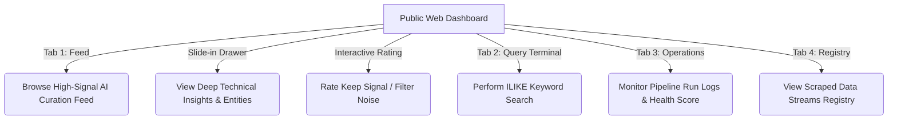
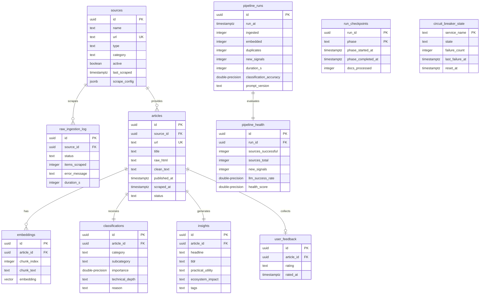

# Product Requirement Document (PRD) — GlaceX.ai

**Document Version:** 1.0.0  
**Author:** AI Coding Assistant pair-programming with the USER  
**Status:** Approved  
**Target Release:** Production Phase 11  

---

## 1. Executive Summary & Vision

### 1.1 Product Vision
In the rapidly accelerating artificial intelligence landscape, keeping track of technical developments, papers, tools, products, and alignment research is a bottleneck for engineers and researchers. **GlaceX.ai** is an autonomous intelligence curation engine that crawls, parses, semantically deduplicates, analyzes, and delivers high-signal AI developments directly to the technical community. 

GlaceX.ai shifts the model of information consumption from manual search and discovery to high-relevance automated alerts and interactive exploration.

### 1.2 Core Value Proposition
- **High Signal-to-Noise Ratio:** Multi-stage classification and thresholding filter out superficial news, marketing hype, and off-topic articles.
- **Semantic Curation:** pgvector-based deduplication ensures that duplicate stories across multiple news outlets are clustered and represented by a single high-signal resource.
- **Structured Deep Insights:** Instead of simple summaries, GlaceX.ai provides actionable technical breakdowns including key discovery headlines, technical TL;DR lists, practical utilities, and ecosystem impact assessments.
- **Fatigue-Free Delivery:** Mobile notifications are intelligently queued, prioritized, routed into tiers, and throttled to respect user attention, including quiet-hour deferrals and digest bundling.
- **Low-Cost Operational Model:** The entire stack runs on free-tier services (Supabase, Groq, Gemini, GitHub Actions) with automated pruning and archival systems to stay within storage limits.

---

## 2. Target Audience & Personas

### 2.1 Technical AI/ML Researchers
* **Needs:** Access to high-depth academic papers, alignment breakthroughs, and novel deep-learning architectures.
* **Pain Points:** Overwhelmed by the sheer volume of daily preprints on arXiv and technical blogs.
* **How GlaceX.ai Helps:** Surfaces only papers with high technical depth and provides structured TL;DR bullet points.

### 2.2 AI Engineers & System Architects
* **Needs:** Information on new developer tools, open-source libraries, APIs, and product releases.
* **Pain Points:** Needs to separate marketing press releases from actual functional libraries.
* **How GlaceX.ai Helps:** Classifies discoveries into categories like `Developer Tools` and evaluates practical utility and ecosystem impact.

---

## 3. Core User Journeys



### 3.1 Curation Discovery & Feedback loop
1. User opens the Web dashboard to browse the **Intelligence Feed**.
2. User filters articles by Category (`Papers`, `Tools`, `Products`, `Companies`, `Newsletters`).
3. User selects an article card; a details drawer slides in from the right.
4. User reads the structured technical insights (Headline, TL;DR, Practical Utility, Ecosystem Impact).
5. User submits rating feedback: clicking `Keep Signal` or `Filter Noise` immediately registers a vote in the database to train the classification prompt.

### 3.2 Real-time Alerts & Digests
1. The pipeline runs every 6 hours via GitHub Actions.
2. A high-signal article (Importance Score > 85) is found. An individual push notification is sent instantly via the `ntfy.sh` mobile app.
3. Medium-signal articles (Importance Score 60-85) are collected and sent as a single unified **Digest** at the end of the run.
4. Notifications are withheld during quiet hours (22:00 to 06:00 local time) and delivered once the quiet window closes.

---

## 4. Functional Requirements

### 4.1 Automated Scrapers & Ingest Layer
* **Req 4.1.1:** Support multi-protocol ingestion: RSS feeds, static web pages (via HTTPX), and dynamic single-page applications (via Playwright headless Chromium).
* **Req 4.1.2:** Scrapers must handle conditional GET requests using `If-Modified-Since` headers to avoid downloading unmodified content.
* **Req 4.1.3:** Domains that are repeatedly offline must trigger domain-level circuit breakers to skip scraping for that host, preventing pipeline delays.
* **Req 4.1.4:** Scraping execution must run concurrently using `asyncio.gather` to reduce ingestion execution time.

### 4.2 NLP, Embedding & Semantic Deduplication
* **Req 4.2.1:** Execute Named Entity Recognition (NER) on ingested text using spaCy (`en_core_web_sm`) to tag organizations, people, and tech concepts.
* **Req 4.2.2:** Generate 384-dimensional text embeddings of scraped titles and snippets using sentence-transformers.
* **Req 4.2.3:** Calculate cosine similarity natively in the database via `pgvector` to identify and mark duplicate or highly similar stories. Skip embedding and classification stages for detected duplicates.

### 4.3 LLM Classification & Extraction
* **Req 4.3.1:** Classify articles using Groq `llama-3.3-70b` for:
  - **Category:** `Paper`, `Tool`, `Product`, `Company`, `Newsletter`, or `General`.
  - **AI Relevancy:** Filter out non-AI or low-depth news.
  - **Importance Score:** Continuous index from 0 to 100.
  - **Technical Depth:** `Low`, `Medium`, or `High`.
* **Req 4.3.2:** If Groq fails due to rate limits or API outages, fall back automatically to `gemini-2.0-flash`.
* **Req 4.3.3:** Use Gemini Flash to extract structured JSON insights: key headline, TL;DR bullets, practical utility, ecosystem impact, and related entities. Bypassed if Gemini circuit breaker is open.

### 4.4 Store, Recovery, & Delivery
* **Req 4.4.1:** Enforce run recovery checkpointing. Record `(run_id, phase, phase_started_at, phase_completed_at)` to the database. If a runner crashes, the pipeline must recover and skip completed phases.
* **Req 4.4.2:** Prioritize notifications by importance score. Route into High (individual push), Medium (digest push), and Low (filtered, no push) tiers.
* **Req 4.4.3:** Enforce quiet hours and cap push notifications to a maximum of 10 per run to prevent user fatigue.
* **Req 4.4.4:** Prune raw ingestion logs older than 90 days. For articles older than 1 year, archive full text to local JSONL files and clear (`NULL` out) database text columns to conserve Supabase free-tier database space.

### 4.5 Curation Explorer Frontend Dashboard
* **Req 4.5.1:** Single Page Application (SPA) served via static HTML/JS/CSS with curated HSL color tokens, dark mode aesthetic, and responsive Tailwind styling.
* **Req 4.5.2:** Contain 4 functional views:
  1. **Intelligence Feed:** Cards with importance score pills, titles, tags, and category filters. Selecting a card reveals the detail slide-in drawer.
  2. **Query Terminal:** Keyword search interface querying the PostgREST API.
  3. **Pipeline Operations:** Runs operational metrics (health score, scraping stats, duration, duplicates count) and execution history table tracking the last 20 automated GitHub Action runs.
  4. **Sources Registry:** Status grid of RSS, Playwright, and HTTPX ingestion sources.
* **Req 4.5.3:** Allow interactive user feedback rating directly from the drawer, updating the `user_feedback` table.

---

## 5. Non-Functional Requirements

### 5.1 Performance & Resource Limits
* **NFR 5.1.1:** Hard ceiling of 20 minutes execution timeout on GitHub Actions runner workflows to prevent infinite loops and API key credit drain.
* **NFR 5.1.2:** Database queries from the web dashboard must complete in under 500ms under standard network conditions.

### NFR 5.2 Reliability & Circuit Breakers
* **NFR 5.2.1:** Maintain persistent circuit breaker states in the database for external services: `Groq`, `Gemini`, `Supabase`, `ntfy.sh`, and scraped domains.
* **NFR 5.2.2:** Outages must transition circuit states from `closed` to `open` (after 3 failures). Cooldown window of 30 minutes must be enforced before attempting `half-open` requests.

### NFR 5.3 Security & Database Policies
* **NFR 5.3.1:** All tables must have Row Level Security (RLS) enabled. Public requests (using publishable `anon` key) are strictly restricted to read-only `SELECT` queries, except for `user_feedback` where `INSERT` and `UPDATE` are permitted.
* **NFR 5.3.2:** Web explorer requests must utilize explicit relationship target selectors (e.g. `insights!insights_article_id_fkey(*)`) to prevent PostgREST `HTTP 300` Multiple Choices ambiguity errors.

---

## 6. System Architecture

```
                    ┌────────────────────────┐
                    │  GitHub Actions Runner │
                    └───────────┬────────────┘
                                │ (executes cron every 6h)
                                ▼
                       [Ingestion Agent]
                 (RSS, Playwright, HTTPX scrapers)
                                │
                                ▼
                         [NLP / NER Agent]
                     (spaCy NER, embeddings)
                                │
                                ▼
                       [Deduplication Agent]
                 (pgvector cosine similarity)
                                │
                                ▼
                       [LLM Analysis Agent]
            (Groq/Gemini Classification & TL;DR)
                                │
                                ▼
                      [Delivery Agent]
            (ntfy.sh alerting & health reporting)
                                │
        ┌───────────────────────┴───────────────────────┐
        ▼ (HTTPS REST API / PostgREST)                  ▼ (Direct DB Connection)
 ┌──────────────┐                                ┌──────────────┐
 │   Supabase   │◄───────────────────────────────┤ Local Admin  │
 │  REST API    │                                │ Setup Script │
 └──────┬───────┘                                └──────────────┘
        │ (Public Anon API Key)
        ▼
 ┌──────────────┐
 │ Web Explorer │
 │  Dashboard   │
 └──────────────┘
```

---

## 7. Data Models & Schema


